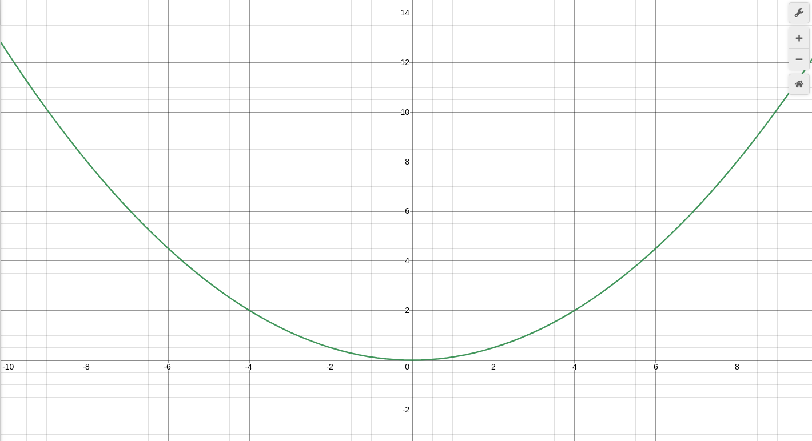
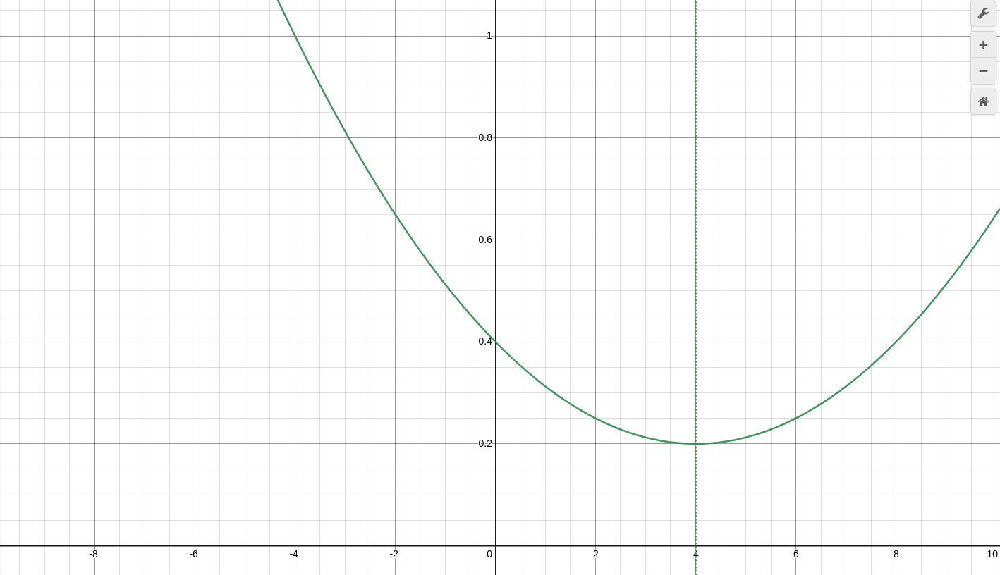

:::note
The first version of this article was published in the [1hive forum](https://forum.1hive.org/t/dynamic-issuance-policy-v2-from-math-to-code-in-one-post/4214).
:::

Some days ago I pointed out some [inconsistencies I found in the issuance policy](https://forum.1hive.org/t/insights-on-dynamic-issuance-after-modeling-it/4187) 1hive is using at the moment. After some days of thinking about it, I'd like to share with the community my work until now. This post has two purposes:
- Propose a new issuance policy for 1hive and the rest of gardens
- Educate about the process I've followed to obtain a result like this.

## Our new Dynamic Issuance Policy?

As the old policy, the proposed Dynamic Issuance v2 tends over time towards a particular ratio between the token balance of the common pool and the total supply (or circulating supply) of the token.

We call this ratio towards the issuance mints or burns tokens the *target ratio*, a number between 0 and 1.

The new issuance policy is configured using two parameters, *target ratio*, already used in the previous version, and *recovery time*, a new parameter that sets the maximum time that it cost for the ratio to recover the target percent.

The formulas that determine the ratio over time when there are no inflows or outflows on the common pool are as follow:

- When we start with a ratio below the *target ratio* (we mint tokens into the common pool):
$f(x)=\frac{-t}{r^{2}}\left(x-r\right)^{2}+t$
- When we start with a ratio above the *target ratio* (we burn tokens from the common pool):
$f(x)=\frac{1-t}{r^{2}}\left(x-r\right)^{2}+t$

Note that both of these formulas only apply within the *recovery time*, after this period, the new ratio is *target ratio*. 

You can observe how these formulas work in [this desmos](https://www.desmos.com/calculator/13bsbqi0k1). You can use *target ratio* to move the ratio vertically and *recovery time* to move the point in which curves touch each other.

 

It's very unlikely that our common pool is totally full or totally empty at any point, but those equations determine the path that the ratio will travel during time starting from any point. So if we start with a ratio of 20% (*current ratio*), we see how the curve travels a shorter path (blue lines in the chart above).

The "blue line" formula is a bit more complex as we have to translate the equation horizontally until it matches the *current ratio* in the Y-axis. It is the following piecewise formula:

 

This can be gracefully translated to Solidity code, as we can see here (or [in remix](https://remix.ethereum.org/?gist=cccf44631d54d0364602acac8881e622)):

```solidity
pragma solidity ^0.4.24;

import "@aragon/os/contracts/lib/math/SafeMath.sol";


contract DynamicIssuance {
    using SafeMath for uint256;

    uint256 constant public RATIO_PRECISION = 1e10;

    uint256 public targetRatio;
    uint256 public recoveryTime;

    constructor(uint256 _targetRatio, uint256 _recoveryTime) public {
        targetRatio = _targetRatio;
        recoveryTime = _recoveryTime;
    }

    function calculateRatio(uint256 _lastRatio, uint256 _time) public view returns (uint256 _ratio) {
        uint256 shared;
        _ratio = _lastRatio;
        if (_ratio < targetRatio) {
            // _time < recoveryTime * sqrt(targetRatio * (targetRatio - _ratio))
            shared = recoveryTime.mul(_sqrt(targetRatio.mul(targetRatio.sub(_ratio))));
            if (_time < shared.div(targetRatio)) {
                // (_ratio * recoveryTime ** 2 + 2 * _time * shared - targetRatio * _time ** 2) / (recoveryTime ** 2)
                _ratio = _ratio.mul(recoveryTime.mul(recoveryTime)).add(_time.mul(shared).mul(2)).sub(targetRatio.mul(_time.mul(_time))).div(recoveryTime.mul(recoveryTime));
            } else {
                _ratio = targetRatio;
            }
        } else if (_ratio > targetRatio) {
            // recoveryTime * sqrt((1 - targetRatio) * (_ratio - targetRatio))
            shared = recoveryTime.mul(_sqrt(RATIO_PRECISION.sub(targetRatio).mul(_ratio.sub(targetRatio))));
            if (_time < shared.div(RATIO_PRECISION.sub(targetRatio))) {
                // (_ratio * recoveryTime ** 2 - 2 * _time * shared + (RATIO_PRECISION - targetRatio) * _time ** 2) / (recoveryTime ** 2)
                _ratio = _ratio.mul(recoveryTime).mul(recoveryTime).sub(_time.mul(shared).mul(2)).add(RATIO_PRECISION.sub(targetRatio).mul(_time).mul(_time)).div(recoveryTime.mul(recoveryTime));
            } else {
                _ratio = targetRatio;
            }
        } else {
            _ratio = targetRatio;
        }
    }

    function _sqrt(uint256 y) internal pure returns (uint256 z) {
        if (y > 3) {
            z = y;
            uint256 x = y / 2 + 1;
            while (x < z) {
                z = x;
                x = (y / x + x) / 2;
            }
        } else if (y != 0) {
            z = 1;
        }
    }
}
```

This is just a proof-of-concept code, the real smart contract has to actually mint or burn tokens to/from the common pool, in a similar way we were doing with the old policy (calling `executeAdjustment()`).

For this particular policy, we will also need to do adjustments every time that the token supply changes (some tokens are minted or burnt), or there are inflows or outflows in the common pool. This means that we will need to register the Dynamic Issuance app as a hook for the Hooked Token Manager in order to be able to act when these events occur.

## How did I arrived to this result

### Obtaining the "pristine" formulas

I think this can be a great opportunity to explain how we can design token policies using simple math models. I recommend using [desmos](https://www.desmos.com/) when you do this kind of explorations during the first stage.

We know that we would like a curve, so we start with the formula y=x² because powers and square roots are easy to calculate in Solidity. If we divide the formula by `r`, we will find that the formula then passes by the points `(r,r)` and `(-r, r)`.

$y = \frac{1}{r}x^2$

 

If we want it to pass by the point `(r, t)`, which is when the *recovery time* (`r`) ends and the ratio (`x`) is *target ratio* (`t`), we have to divide by `r` again in order to obtain the point `(r, 1)`, and by `t` to obtain `(r, t)`:

$y = \frac{t}{r^2}x^2$

 

We now have a formula that passes by the points `(0,0)` and `(r, t)`, but it doesn't have the shape that we want, as it should decrease it's speed of emission of tokens as it reaches the *target goal* instead of increasing it.

In order to solve that issue we are going to apply some geometrical transformations. We will first flip the chart upside down and then we will move the entire chart from point `(0, 0)` to point `(r, t)`. To flip the chart we just have to multiply the formula by -1:

$y = -\frac{t}{r^2}x^2$

 

And to move the maximum of the formula, currently at point `(0, 0)`, into the point in which *recovery time* has passed and we reach the *target ratio* `(r, t)`, we can do a [simple translation](https://en.wikipedia.org/wiki/Translation_(geometry)), substracting `r` from `x` and `t` from `y`:

$y=-\frac{t}{r^2}(x-r)^2+t$

 

The "deflationary" formula can be obtained by replacing the `-t` factor by `1-t`. It inverts the shape of the formula again because  `1-t` is positive (knowing that `t≤1`), and we want the formula go from 1 to `t` so its height must be `1-t`:

$y=\frac{1-t}{r^2}(x-r)^2+t$

 

### Obtaining the "left-shifted" formulas

In order to shift the formulas to the left until they touch the point `(0,c)` so we start at time 0 with a specific ratio (`c`). When you need to work with equations, [Wolfram Alpha](https://www.wolframalpha.com/) is your friend.

We isolate x from the "inflationary" formula and we obtain the following result:

$x=\frac{rt-r\sqrt{t^2-t\cdot f(x)}}{t}$

We then add on the left side a shift to the point in which `f(0)=c`, and then solve `f(x-c)`:

$x+\frac{rt-r\sqrt{t^2-tc}}{t}=\frac{rt-r\sqrt{t^2-t\cdot f(x-c)}}{t}\rightarrow f(x-c)=\frac{cr^{2}+2rx\sqrt{t(t-c)}-tx^{2}}{r^{2}}$

We do the same for the "deflationary" formula, first isolate x:

$x=\frac{r\sqrt{(t-1)(t-y)}}{t-1}+t$

And then obtain the "left-shifted" formula:

$x+\frac{r\sqrt{(t-1)(t-c)}}{t-1}+t=\frac{r\sqrt{(t-1)(t-f(x-c))}}{t-1}t\rightarrow f(x-c)=\frac{cr^{2}-2rx\sqrt{(1-t)(c-t)}+\left(1-t\right)x^{2}\ }{r^{2}}$

 

We also have to take into account that *recovery time* is going to be less, since we are not starting from 0% or 100%. We have to calculate where the global maximum and minimum of the formulas are in order to avoid going backwards.

The maximum of the pristine "inflationary" formula is `r`, as it is how we defined it from the beginning. The maximum of the "left-shifted" "inflationary" formula can be found equating it's first derivative to 0.

$\frac{d}{dx}\frac{c r^2 + 2 r x \sqrt{t (-(c - t))} - t x^2}{r^2} = \frac{2\left(r\sqrt{t(t-c)}-tx\right)}{r^2}=0\rightarrow x=\frac{r\sqrt{t(t-c)}}{t}$


So we know now the point in which we should stop applying the formula and return target ratio instead (used in the piecewise formula above).

We can do the same for the "left-shifted" "deflationary" formula, obtaining the `x` in which:

$\frac{d}{dx}\frac{(c r^2 - 2 r x \sqrt{(t - 1) (-(c - t))} - t x^2 + x^2}{r^2} = -\frac{2\left(r\sqrt{(t-1)(t-c)}+(t-1)x\right)}{r^2}=0\rightarrow x=\frac{r\sqrt{(1-t)(c-t)}}{1-t}$

Which is the check that we do in the piecewise formula when the *current ratio* (`c`) is greater than *target ratio* (`t`).

 

### Coding the formula

After defining the formula, it was straightforward to write the Solidity code for it. The only think I had to take into account is that ratios are scaled with a factor of 10^10 in order to be able to operate with Solidity (the language has no native support for decimals).

So when I was dealing with the ratios in the code you have to remember that, and use `RATIO_PRECISION` constant instead of 1 to do the calculations.

Also the use of fixed point arithmetic could interfere with the function `_sqrt(uint256 y)` but we have been lucky and all the square roots we needed to do where already multiplications of two ratio-scaled factors, so the result was also ratio-scaled.

## Conclusion

This post has presented a piecewise formula to model the proposed Dynamic Issuance Policy v2, alongside with a proof-of-concept Solidity smart contract. I think it is a considerable improvement in respect to the previous version, but I would love to hear the comments of the community members :bee: in order to go forward with the proposal.

This post has also been useful to explain in a detailed way the process of obtaining the formula. Hopefully this method can be replicated in the future by other token engineers to create similar policies, not only for token issuance but also for other endeavours. I hope it becomes a helpful resource in the process of designing and implementing of a token policy from its inception to the functional code.

----

*Edited 3rd August, 2021: @divine_comedian helped me clarify some terms that were a bit opaque in the first version.*