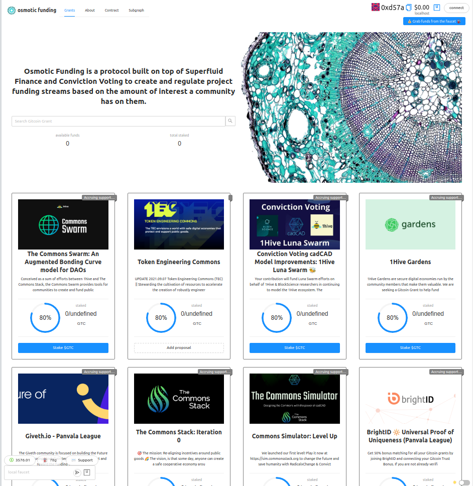

:::note
You can find the first version of this article as a [hackmd](https://hackmd.io/0KwBbSNTSleYbAChGjkhyQ?view) published during the ETHOnline '21 hackathon.
:::

**Osmotic Funding** is a protocol built on top of Superfluid Finance and Conviction Voting to create and regulate project funding streams based on the amount of interest a community gives them. Community preference is revealed continuously, since tokenholders are able to update their preferences (change their stake) at any moment.

A community of tokenholders (DAO) can use Osmotic Funding to decide which parts of the DAO should receive funding and how much. Funding proposals need a minimum amount of support to start receiving funds. Once the flow is open, they can grow or shrink over time, depending on the stake with which the token holders are supporting the proposals.

## Mechanism

We have prepared a desmos for displaying the different parameters and calculations the algorithm uses to distribute funds. **[>> Please go ahead and play along with it <<](https://www.desmos.com/calculator/uximezgfvq)**.

Depending on the distribution of staked tokens and the available funds in the pool, we can calculate which will be the rate of each proposal with:

$$r_\infty(i) = B · \left ( 1 - \sqrt{\frac{T}{max(T, s_i)}} \right ) \\ \textrm{where}\ T = \gamma · (s_0 + s_1 + ... + s_n) + T_0\\\textrm{ and }\ B = b · \beta$$

1. The target rate ($r_\infty$) of a proposal ($i$) is the amount of funds a project should be receiving per second in the future. 
2. The pool balance ($b$) is the amount of funding tokens that can be transmitted to grants. It will keep diminishing if there are no inflows that fund the contract at the same rate.
3. Max spending ratio ($\beta$) is the max percentage of the pool balance that one proposal can spend per second.
4. Threshold ($T$) is the minimum amout of staked tokens a proposal needs to start getting funded depending on amount staked on the rest of the proposals.
    - Threshold ratio ($\gamma$) determines the increse in the threshold for each new token staked on any proposal.
    - Min threshold ($T_0$) is the minimum amount of tokens required to fund a proposal when no other proposal is being funded.
    - Total staked tokens ($s_0 + s_1 + ... + s_n$) are the amount of tokens that are actively voting in the protocol. It plays against a proposal if new tokens are staked on other proposals.
6. Staked tokens ($s_i$) are how many tokens are staked on the proposal which we calculate the rate for.

When the staked amount on a proposal ($s_i$) changes, the rate changes over time following the following formula:

$$r_{t}(i) = \alpha^t · r_{0}(i) + (1-\alpha^t) · r_{\infty} (i)$$

1. The current rate ($r_t$) of a proposal ($i$) is the amount of funds per second a proposal receives in a particular instant of time ($t$).
2. The last rate ($r_0$).
3. The exponential decay base ($\alpha$) is a number from 0 to 1 that determines the speed in which the current rate is going to reach the target rate.

As you can see the formula has two parts. The first part starts with last rate and ends at zero over time. The second part starts at zero and grows up to target ratio over time.

Every time the target ratio changes (due to a change in token staking), we define the current ratio as the last ratio, so the rate over time can still be a continuous formula, and we reset the timer ($t$) to zero.

In order to know the amount of funds a proposal has accrued since the last time there was a stake change, we can calculate the definite integral of the current rate ($r_t$) formula over time:

$$f_{t}(i) = \int_{0}^x r_t(i)\ dt= \int_{0}^x \left[\alpha^t · r_{0}(i) + (1-\alpha^t) · r_{\infty} (i) \right]dt$$

$$f_{t}(i) = \frac{\left(1-\alpha^{x}+x\ln\alpha\right) · r_\infty(i)-\left(1-\alpha^{x}\right) · r_0(i)}{\ln\alpha}$$

Because the target rate formula ($r_\infty$) does not depend on the time, we can treat it as a constant in the integral, which makes it not-so-difficult to calculate.

It calculates is the area below the curve defined by the current rate formula over time, which correspond to the amout of funds, or what is the same, the average rate (of all variations of $r_t(i)$ over the period of time) multiplied by time ($t$). 

# Appendix

## Some research on botany

We have done some research in botany in order to understand how plants distribute their resources. We hope you can 

* [Vascular tissue](https://en.wikipedia.org/wiki/Vascular_tissue) - plants have different types of conducting tissues:
    * [Xylem](https://en.wikipedia.org/wiki/Xylem) - transports water and minerals from the roots upwards. Types:
        * [Tracheid](https://en.wikipedia.org/wiki/Tracheid) - primitive tissue, produces softwood.
        * [Xylem vessel](https://en.wikipedia.org/wiki/Vessel_element) - present in most flowering plants, produces hardwood. 
    * [Phloem](https://en.wikipedia.org/wiki/Phloem) - transports products of photosynthesis to various parts of the plant.
* [Vascular bundle](https://en.wikipedia.org/wiki/Vascular_bundle) - Joins many tissues, including xylem and phloem.
* [Stele](https://en.wikipedia.org/wiki/Stele_(biology)) - central part of the root or stem of a plant, which contains vascular tissue.
    * Most seed plant stems primary vascular tissue are vascular bundles.
    * [Photo gallery](https://www.flickr.com/photos/146824358@N03/35914299553/in/photostream/).
* [Osmosis](https://www.biologyonline.com/tutorials/water-in-plants) - why water moves from the root to the leaves.

> The presence of vessels in xylem has been considered to be one of the key innovations that led to the success of the flowering plants.

## Screenshot

