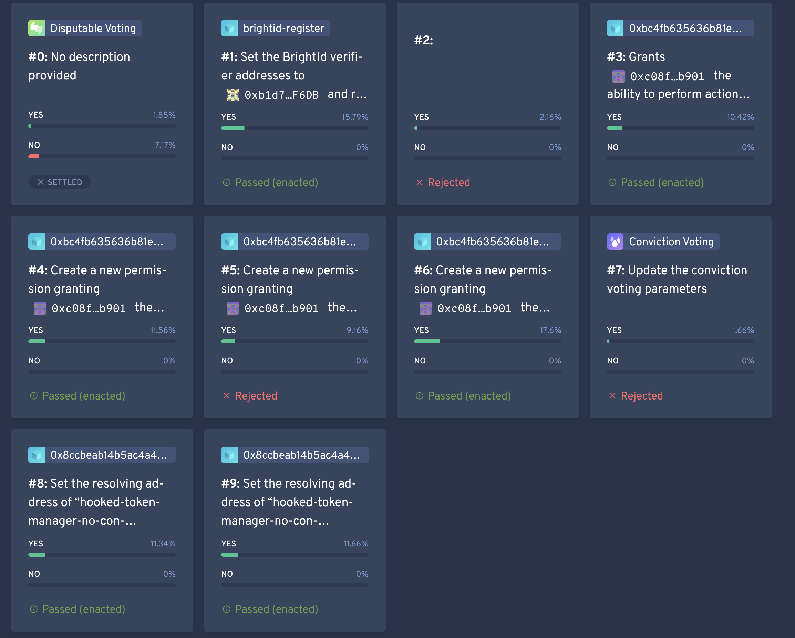

## The challenge

The Aragon community had voted to [move the project's treasury into a DAO governed by delegated ANT](https://forum.aragon.org/t/proposal-transfer-the-aragon-project-funds-to-an-aragon-dao-governed-by-delegated-ant/3369). The requirements were clear:

- ANT holders can delegate all or part of their voting power.
- They can override their delegate's vote, or undelegate, at any time.
- Anyone can put themselves forward as a delegate.

The Aragon Network DAO that existed then [couldn't do any of this](https://forum.aragon.org/t/current-dao-unsuitable-for-fund-transfer/3566/20). And a DAO holding hundreds of millions has no room for experiments: every new line of code adds attack surface.

## Our approach

**Build as little new code as possible.** In June 2022 we proposed a design based on one principle: a treasury DAO should do very little. It holds the funds safely and passes part of them along for day-to-day operations. So instead of writing new contracts, we combined AragonOS apps that were already audited and running in production.

**Do it with the ecosystem.** In July 2022 the design became a joint proposal with 1Hive Gardens, the Token Engineering Commons, dTech and General Magic. Each team maintained a piece of the stack we needed. The Executive SubDAO approved it unanimously within a few days.

**Let the community choose its governance.** A DAO is only as good as its parameters, and we didn't want to pick them ourselves. More on that below.

The core of the design is **Tao Voting**, the finished version of Aragon One's Disputable Voting that 1Hive already used in Gardens. Compared to the standard AragonOS voting app, it adds:

- **Delegation**, where delegators keep the right to overrule their delegate.
- **Quiet ending**, which extends a vote if the result flips at the last minute, so a whale can't swing it at the close.
- **Disputability**, so a proposal that breaks the DAO's agreement can be challenged.

Voting also needs to know how tokens were distributed when a vote starts. Otherwise people could vote, transfer their tokens and vote again. ANT had lost that ability when it moved to ANTv2, so we used a **Token Wrapper** to bring it back.

## Parameters chosen by the community

Working with the Token Engineering Commons, we copied the process it had used to set up its own DAO in 2021:

- General Magic built the [Aragon Tao Voting config](https://www.taovoting.info/), where anyone could try different parameters, see how they changed voting times, and submit their configuration.
- TEC wrote [eight explainers](https://forum.aragon.org/t/financial-proposal-demoing-a-tao-voting-dao/3622/24), one per parameter, and hosted three param parties.
- The AN DAO community guild ran three param debates. The community then ranked the submitted configurations with quadratic voting.

The debates reached consensus on a full configuration, with a short reason for each choice:

| Parameter | Proposed | Why |
| --- | --- | --- |
| Support required | 57% | A qualified majority leaves fewer grounds to contest results |
| Minimum quorum | 0.5% | Start low to avoid deadlock, and raise it as data comes in |
| Vote duration | 7 days | Enough, after two weeks of forum discussion |
| Delegated voting period | 3 days | Leaves delegators time to disagree and undelegate |
| Quiet ending | 1 day, +3 days | Guards against last-minute swings, even over a weekend |
| Execution delay | 3 days | Time to exit for anyone who disagrees with the outcome |
| Proposal / challenge deposit | 1,024 / 128 ANT | Low enough not to discourage anyone |
| Settlement period | 5 days | Enough time to reach a shared decision |

## From demo to production

The original proposal was an eight-week demo. It grew as it went. The Aragon Association took over coordination and set the production requirements: two layers of treasury, a guardians council with veto power, a delay on every proposal, and audited contracts. It was a lot more work, and it took longer than the first timeline. It also gave a much safer result.

Lazuline, the lightweight client we built on subgraphs, which later became the Aragon DAO app.

## What we shipped

We deployed the [Aragon DAO](https://mainnet.aragon.blossom.software/#/0x08101cFEA107326820C701A8A5caD87620670a99/permissions/) to Ethereum mainnet. It is made of two DAOs and three new apps.

### Three new AragonOS apps

- **[Blossom Token Wrapper](https://github.com/BlossomLabs/token-wrapper-aragon-app)** wraps ANT into non-transferable **wANT**, which records voting snapshots.
- **[Blossom Tao Voting](https://github.com/BlossomLabs/tao-voting-aragon-app)**: our version of Tao Voting, with delegation and quiet ending.
- **[AN Delay](https://github.com/BlossomLabs/an-delay-app)** holds every proposal for seven days before it becomes a vote. Submitting one costs a 5,000 ANT fee, which goes to the treasury if the proposal is cancelled.

### The Aragon DAO: governance and budget

| | Governance | Budget |
| --- | --- | --- |
| Holds | Most of the treasury | Funds for operations |
| Controls | Everything, including the DAO's own permissions | Payments through Finance, in 30-day periods |
| Support / minimum approval | 50% / 1.5% of wANT | 50% / 1.5% of wANT |
| Vote duration | 7 days | 7 days |
| Delay before voting | 7 days | 7 days |

### The Shield DAO: the guardians

A small membership DAO ([shield.aragonid.eth](https://mainnet.aragon.blossom.software/#/shield)) holds non-transferable GUARD tokens for two multisigs: the [EVM Guardians](https://app.safe.global/eth:0x70508B8eaAf45846Ae4CEe12e52E86A0c6be84E9) and the [Legal Guardians](https://app.safe.global/eth:0xa0F937A6B33e339cD383bb94906eB8107241655e/). Only they can pause, resume or cancel a proposal while it is delayed. The Shield DAO's members add and remove guardians by vote.

### Deployed with one script, tested on forks

We configured the whole DAO with [a single EVMcrispr script](https://evmcrispr.com/#/terminal/QmUXLuGEemSqAhN9YMyhMp8SB9JkpVwmxnfTGKfwAhZ1Xc), so anyone could review it before it ran. Before handing it over, we tested every flow on Tenderly forks:

- a normal [governance](https://evmcrispr.com/#/terminal/QmePQ3QNMxHrsTv2MgxpkqEwqV5T642R19ZgucYbBkr5KV) proposal and a normal [budget](https://evmcrispr.com/#/terminal/QmVj4hnUgnebdMkQ49tYUbzTMq6DjQ94PgsGGrHvTWRVXc) proposal;
- the guardians cancelling a [governance](https://evmcrispr.com/#/terminal/QmfQYeQuaojkxrGJ8jGAwwFrQrHEEKF9yCX2JgURmtZSuN) or a [budget](https://evmcrispr.com/#/terminal/QmbQGVoPY77e73NZ2AJ4adcp6ZZErx9Q3TdDoBbQq3HwZP) proposal.

### A fast frontend

The [Aragon DAO app](https://github.com/BlossomLabs/aragon-dao) grew out of Lazuline. It loads its data from subgraphs we deployed for Token Wrapper, Tao Voting, AN Delay and Finance, shows the governance and budget sides separately, and lets guardians act on delayed proposals.

## What came next

The design outlived the Aragon treasury. In December 2023 the **Token Engineering Commons** moved its DAO from Gardens on Gnosis Chain to Optimism, and [rebuilt it on the same architecture](https://forum.tecommons.org/t/optimism-tec-dao-specification/1317): one Tao Voting for governance and another for the budget, an AN Delay on each, and a separate guardians DAO that can only stop malicious proposals.

## What we learned

- **Use code that has already been tested in production.** Almost every contract in the DAO had already held real value somewhere else. The new code was small and easy to review.
- **Write deployments as scripts.** Because the whole DAO was one EVMcrispr script, it could be reviewed, tested on a fork and run again exactly as reviewed.
- **Choosing parameters is part of governance.** Param parties and debates made the community decide on the trade-offs, not only on the numbers.
- **A demo aimed at production becomes production work.** Once the demo was going to hold real funds, the requirements grew with it. We'd plan for that from day one next time.
