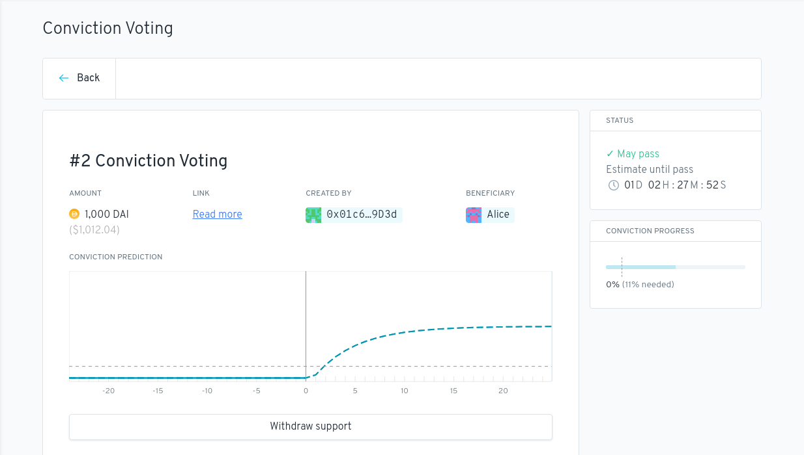

## The challenge

In 2019, a DAO that wanted to fund work from its treasury had one tool: a yes/no vote per proposal, each counted on its own. That model breaks down as soon as a community has many proposals competing for the same money:

- A majority can pass anything, and ignore everyone else (the 51% attack).
- Most token holders don't show up for each vote, so a small, well-timed group decides.
- There's no way to say *which* proposals matter more. Every vote is judged on its own, not against the others.

**Conviction voting** was a different answer. It came out of Michael Zargham's research at BlockScience, and the Commons Stack and 1Hive wanted it as the funding engine for their communities. Token holders stake on the proposals they support, as many as they like, and can move their stake at any time. The longer tokens stay on a proposal, the more *conviction* it builds. When conviction crosses a threshold, the proposal passes and is paid, with no deadline and no vote to call.

A first prototype, *gitviction*, came out of a Commons Stack hackathon at ETHParis. It wasn't yet something a DAO could install.

## What we built

On 24 August 2019 we started turning that prototype into a real **Aragon app**: a contract any Aragon DAO could install next to its Vault and Tokens apps, and a frontend that ran inside the Aragon client.

### The maths, on-chain

Conviction works like a charging capacitor. Each block, a proposal keeps a fraction $a$ of its previous conviction and adds the tokens currently staked on it, $x$:

$$y_t = a \cdot y_{t-1} + x$$

Staking more makes conviction rise towards a maximum of $x / (1 - a)$. Withdrawing makes it decay. The default $a$ gives conviction a half-life of **three days**, so a proposal needs sustained support, not a spike. Last-minute whales can't swing a result, because conviction takes days to build.

A proposal passes when its conviction crosses a threshold that depends on how much of the treasury it asks for:

$$\text{threshold} = \frac{\rho \cdot S}{(1 - a)\,\left(\beta - \frac{r}{R}\right)^2}$$

Here $r$ is the amount requested, $R$ the funds available, $S$ the total tokens staked on all proposals, $\beta$ the maximum share of the treasury a single proposal can ask for (20% by default), and $\rho$ a tuning weight. Asking for more money needs disproportionately more conviction, and a request close to $\beta$ is practically unreachable.

Getting this into Solidity took several iterations:

- **Closed-form conviction.** Instead of updating every proposal every block, the contract computes conviction for any number of elapsed blocks in one step. Staking and withdrawing cost the same no matter how long ago the last update was.
- **Overflow safety.** Raising $a$ to large powers overflowed in early versions. The final contract does the maths in 128-bit fixed point, with `SafeMath` throughout.
- **A minimum stake for the threshold.** If only a handful of tokens are staked, $S$ is tiny and so is every threshold. We made $S$ never fall below a set share of the token's supply, so a small group can't drain the treasury while everyone else is away.
- **No double counting.** When staked tokens are transferred or burned, the app unstakes them from proposals first, so the same tokens can never support proposals from two accounts.

With no Vault set, the same app works as pure **conviction signalling**: a continuous, ranked read of what a community cares about, with no money attached.

### Making conviction visible

A number that keeps changing on its own is hard to trust, so a lot of the work went into the interface. Every proposal shows its conviction progress against its threshold, a **trend** that predicts where conviction is heading, and a countdown estimating **when it will pass** if support stays the same. The detail view plots the conviction curve before and after your own stake changes.

A proposal's detail view: conviction prediction, threshold, and estimated time until it passes.

The parameters were modelled alongside the code in a [cadCAD notebook series](https://github.com/1Hive/conviction-voting-cadcad) by Aragon, 1Hive, BlockScience and the Commons Stack, so communities could see how a choice of half-life or $\beta$ would behave before deploying it.

## Aragon's Conviction Funding pilot

In August 2020, the Aragon Association ran the first large conviction voting experiment on mainnet: the **[Conviction Funding pilot](https://blog.aragon.org/introducing-the-conviction-funding-pilot/)**. ANT holders, based on a snapshot of their balances, allocated **$50,000** from a 9,000 ANT treasury to community proposals, both funding and signalling, from 27 August to 8 October.

After its first week, the pilot had **20 proposals**, 2,100 of 9,000 ANT staked, and **4 projects funded**. Aragon described the program as the result of research and development by Aragon One, 1Hive, BlockScience and the Commons Stack. Alongside the pilot, we added tooling to the app to measure the gas cost of every transaction and to dump a Conviction Voting contract's full state for analysis.

## From pilot to Gardens

1Hive carried the app forward into **[Gardens](https://gardens.1hive.org)**, its platform for community DAOs, where conviction voting is the funding engine:

- Proposals became **disputable**. A community agreement governs what can be proposed, and anyone can challenge a proposal that breaks it.
- Proposals can request a **stable value**, priced through an oracle, so a grant doesn't change size when the token's price moves.
- An **abstain** proposal lets token holders raise the threshold for everyone else without backing anything.
- Funds can come from sources other than an Aragon Vault.

We kept contributing, for example letting DAOs attach an ACL oracle to decide who can create proposals.

## What came next

Conviction voting set the question most of our later work tried to answer: **how does a community keep money flowing to the work it believes in, without running a funding round?**

- **[Osmotic Funding](/blog/osmotic-funding/)** (2021) replaced one-off payouts with Superfluid streams, so each proposal's funding *rate* follows the conviction behind it. 1Hive later ran it in production as **[Fluid Proposals](https://github.com/1Hive/fluid-proposals)**.
- The **[Aragon DAO](/work/aragon-dao/)** (2022) was built on Tao Voting, the voting app 1Hive used in Gardens.
- **[CouncilHaus](/work/councilhaus/)** (2024) applied continuous, streamed funding to a smaller group of judges for Superfluid's Frontier Guild.

## What we learned

- **Make the maths visible.** Conviction is intuitive once you can see it growing. The trend, the prediction chart and the time-to-pass estimate did more for adoption than any explanation.
- **Model before you ship.** The cadCAD models let communities pick parameters from simulations, not guesses, and caught behaviours that are hard to see in code.
- **Defaults are governance.** The minimum stake for the threshold and the maximum request ratio decide who can move a treasury. They deserved as much care as the contract itself.
- **Open source compounds.** Code started from a hackathon prototype became an Aragon app, a mainnet pilot and then the base of Gardens, each step built by a different team.
